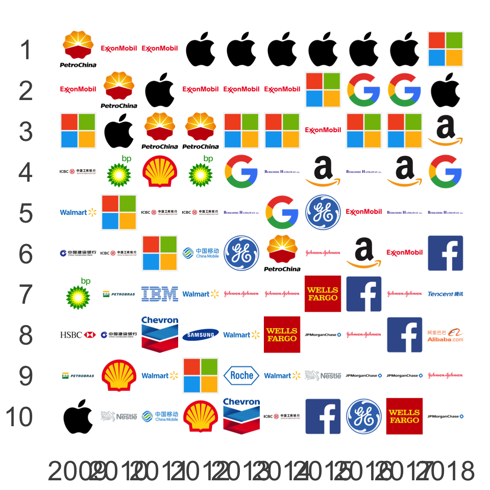
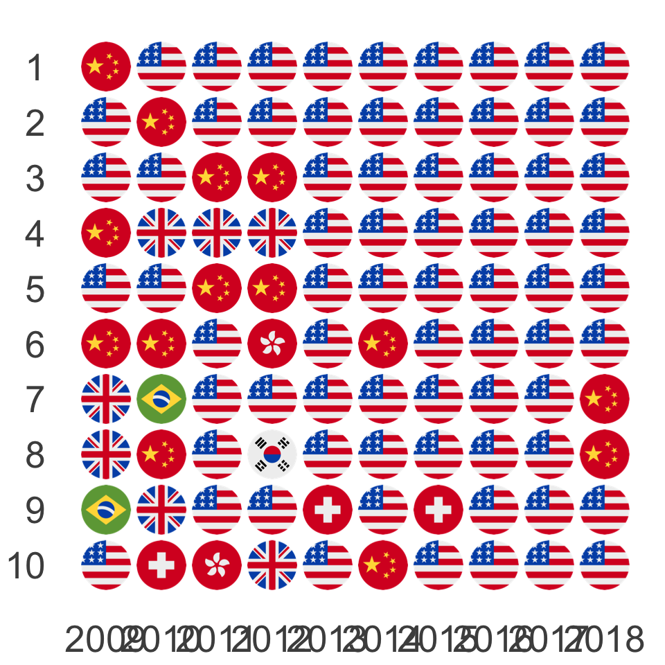
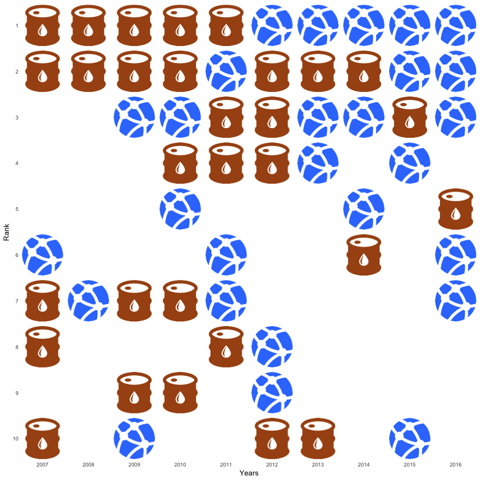

```{r setup, include=FALSE}
knitr::opts_chunk$set(
  echo = TRUE,
  fig.width = 10,
  fig.height = 10)
```

# Rise of Digital Platforms Over 2009 to 2018

Based on data in 

```{r input}
mcs = read.csv("marketcapitalizations.csv")
```

## Oil Barrons Stepped Down - Silicon Kids Moved Up

Companies | Nations | Industries
:---:|:---:|:---:
 |  | 

Icons made by 

```{r tenyearsafter}
library(ggplot2)
library(png)
library(grid)

tenyearsafter<-function(years, ranks, names, folder) {
  extent = 0.9
  
  ggplot() +
    labs(x = "Years", y = "Rank") +
    theme(
      axis.text.x      = element_text(size = 40),
      axis.text.y      = element_text(size = 40),
      axis.title.x     = element_blank(),
      axis.title.y     = element_blank(),
      axis.ticks       = element_blank(),
      panel.grid.major = element_blank(),
      panel.grid.minor = element_blank(),
      panel.background = element_blank()
    ) +
    
    scale_x_continuous(
      limits = c(2008.5,2018.5),
      breaks = seq(2009,2018,1)
    ) +
    scale_y_continuous(
      limits = c(0.5,10.5),
      breaks = seq(1,10,1),
      labels = seq(10,1,-1)
    ) +
    
    coord_fixed() +
    
    mapply(function(xx, yy, nn) 
      annotation_custom(
        rasterGrob(
          readPNG(paste("icons/", folder,"/", nn,".png",sep=""))),
        xmin = xx      - extent/2,
        xmax = xx      + extent/2,
        ymin = (11-yy) - extent/2,
        ymax = (11-yy) + extent/2),
      years, ranks, names)
}
```

# Rise of Digital Platforms / Companies

Top 10 publicly traded companies worldwide wrt market
capitalization and shifts over the years 2007 - 2016.

```{r companies}

tenyearsafter(mcs$Year,
              mcs$Rank,
              mapply(function(cc)
                gsub(" ", "",
                  gsub("&", "",
                    gsub("-", "",
                      tolower(cc))
                     )),
                mcs$Company),
              "companies")

```

# Rise of Digital Platforms / Companies (GAFA)

With the Google logo (instead of Alphabet) the
GAFA effect becomes visible immediately.

```{r companies-gafa}

tenyearsafter(mcs$Year,
              mcs$Rank,
              mapply(function(cc)
                gsub(" ", "",
                  gsub("&", "",
                    gsub("-", "",
                      gsub("alphabet", "google",
                        tolower(cc))))),
                mcs$Company),
              "companies")

```

# Rise of Digital Platforms / Industries

In 2007 the Oil & Gas industry was represented by 5 companies among the top 10
in the ranking. In 2016 (end of year) the Information Technology industry took 5
positions among the top 10.

```{r industries}

tenyearsafter(mcs$Year,
              mcs$Rank,
              mapply(function(ii)
                if (ii == "Information Technology") "it" 
                else if (ii == "Oil and Gas")       "oil"
                else                                "empty",
                mcs$Industry),
              "industries")

```

# Rise of Digital Platforms / Nations

By the end of 2016 the United States alone take all 10 places in the ranking. 

```{r nations}

tenyearsafter(mcs$Year,
              mcs$Rank,
              mapply(function(nn)
                gsub(" ", "",
                      tolower(nn)),
                mcs$Nation),
              "nations")

```
