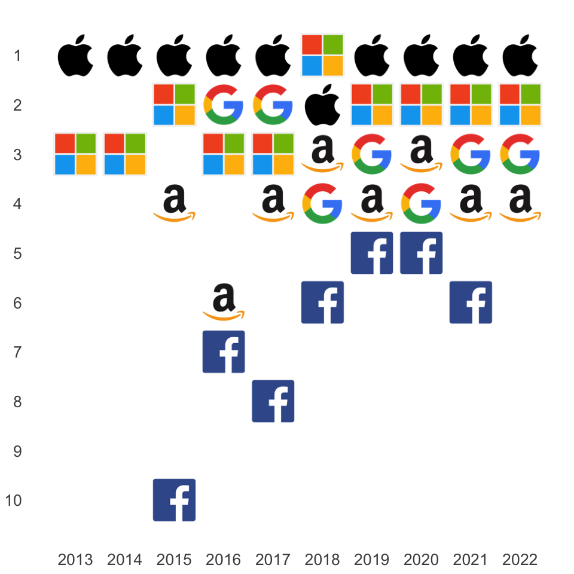

Digitalization - Pipelines to Platforms
================

# Rise of Digital Platforms Over 2011 to 2020

Based on data in [List of public corporations by market capitalization @
Wikipedia](https://en.wikipedia.org/wiki/List_of_public_corporations_by_market_capitalization)

``` r
mcs = read.csv("marketcapitalizations.csv")
```

## Oil Barrons Stepped Down - Silicon Kids Moved Up

|                   Companies                    |                   Nations                    |                   Industries                    |
|:----------------------------------------------:|:--------------------------------------------:|:-----------------------------------------------:|
|  |  |  |

Icons made by [Freepik](https://www.flaticon.com/authors/freepik)

``` r
library(ggplot2)
library(png)
library(grid)

tenyearsafter<-function(years, ranks, names, folder) {
  extent = 0.9
  
  ggplot() +
    labs(x = "Years", y = "Rank") +
    theme(
      axis.text.x      = element_text(size = 20),
      axis.text.y      = element_text(size = 20),
      axis.title.x     = element_blank(),
      axis.title.y     = element_blank(),
      axis.ticks       = element_blank(),
      panel.grid.major = element_blank(),
      panel.grid.minor = element_blank(),
      panel.background = element_blank()
    ) +
    
    scale_x_continuous(
      limits = c(2010.5,2020.5),
      breaks = seq(2011,2020,1)
    ) +
    scale_y_continuous(
      limits = c(0.5,10.5),
      breaks = seq(1,10,1),
      labels = seq(10,1,-1)
    ) +
    
    coord_fixed() +
    
    mapply(function(xx, yy, nn) 
      annotation_custom(
        rasterGrob(
          readPNG(paste("icons/", folder,"/", nn,".png",sep=""))),
        xmin = xx      - extent/2,
        xmax = xx      + extent/2,
        ymin = (11-yy) - extent/2,
        ymax = (11-yy) + extent/2),
      years, ranks, names)
}
```

# Rise of Digital Platforms / Companies

Top 10 publicly traded companies worldwide wrt market capitalization and
shifts over the years 2011 - 2020.

``` r
tenyearsafter(mcs$Year,
              mcs$Rank,
              mapply(function(cc)
                gsub(" ", "",
                  gsub("&", "",
                    gsub("-", "",
                      tolower(cc))
                     )),
                mcs$Company),
              "companies")
```

<!-- -->

**Nota Bene**: The wikipedia page cited above ranks **Saudi Aramco** at
the first position for the fourth quarter of 2019 with a valuation of
1,900,000 million USD. Apple is ranked at the second position with a
valuation of 1,305,000 million USD.

On the one hand, if you compare the 1,305,000 million USD valuation
given on wikipedia with the 1,298,000 million USD you recognise that
there might be slight variations by using different sources, formula, or
days. But Saudi Aramco is different.

There seem to be estimates of the owner Mohaamed bin Salman at 2,00,000
million USD.

More conservative estimates come to about 1,400,000 million USD, and
Wood Mackenzie estimates the valuation of Aramco at only 500,000 million
USD.

[Article “Wie viel ist der Ölgigant Aramco wirklich wert?” in Frankfurt
Allgemeinee
Zeitung](https://www.faz.net/aktuell/finanzen/aktien/erdoel-gigant-saudi-aramco-plant-milliarden-boersengang-14989211-p2.html)

# Rise of Digital Platforms / Companies (GAFA)

With the Google logo (instead of Alphabet) the GAFA effect becomes
visible immediately.

|     |     |          |
|----:|:---:|:---------|
|   G |  =  | Google   |
|   A |  =  | Apple    |
|   F |  =  | Facebook |
|   A |  =  | Amazon   |

``` r
mcsgafa = mcs

gafa_codes <- c("Amazon", "Apple", "Facebook", "Alphabet")

levels(mcsgafa$Company) <- c(levels(mcsgafa$Company), "Blank")

for (i in seq_along(mcsgafa$Company)) {
  if (! (mcsgafa$Company[[i]] %in% gafa_codes))
    mcsgafa$Company[[i]] <- "Blank"
}

tenyearsafter(mcsgafa$Year,
              mcsgafa$Rank,
              mapply(function(cc)
                gsub(" ", "",
                  gsub("&", "",
                    gsub("-", "",
                      gsub("alphabet", "google",
                        tolower(cc))))),
                mcsgafa$Company),
              "companies")
```

<!-- -->

# Rise of Digital Platforms / Companies (GAFAM)

The GAFAM effect with the rise of Microsoft impresses even more.

|     |     |           |
|----:|:---:|:----------|
|   G |  =  | Google    |
|   A |  =  | Apple     |
|   F |  =  | Facebook  |
|   A |  =  | Amazon    |
|   M |  =  | Microsoft |

``` r
mcsgafam = mcs

gafam_codes <- c("Amazon", "Apple", "Facebook", "Alphabet", "Microsoft")

levels(mcsgafam$Company) <- c(levels(mcsgafam$Company), "Blank")

for (i in seq_along(mcsgafam$Company)) {
  if (! (mcsgafam$Company[[i]] %in% gafam_codes))
    mcsgafam$Company[[i]] <- "Blank"
}

tenyearsafter(mcsgafam$Year,
              mcsgafam$Rank,
              mapply(function(cc)
                gsub(" ", "",
                  gsub("&", "",
                    gsub("-", "",
                      gsub("alphabet", "google",
                        tolower(cc))))),
                mcsgafam$Company),
              "companies")
```

<!-- -->

# Rise of Digital Platforms / Industries

In 2007 the Oil & Gas industry was represented by 5 companies among the
top 10 in the ranking. In 2020 (end of year) the Information Technology
industry takes 7 positions among the top 10.

``` r
tenyearsafter(mcs$Year,
              mcs$Rank,
              mapply(function(ii)
                if (ii == "Information Technology") "it" 
                else if (ii == "Oil and Gas")       "oil"
                else                                "empty",
                mcs$Industry),
              "industries")
```

<!-- -->

# Rise of Digital Platforms / Nations

By the end of 2020 the United States alone take 7 places in the ranking.

Meanwhile China holds three positions in the top 10 with the platform
companies Alibaba und Tencent as well as TSMC (Taiwan Semiconductor
Manufacturing Company).

``` r
tenyearsafter(mcs$Year,
              mcs$Rank,
              mapply(function(nn)
                gsub(" ", "",
                      tolower(nn)),
                mcs$Nation),
              "nations")
```

<!-- -->
